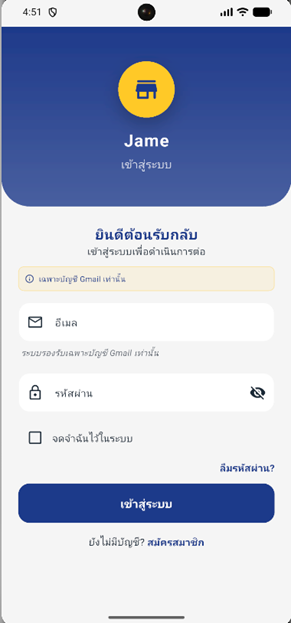
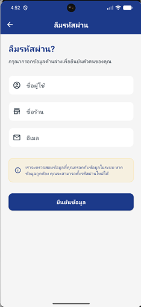

# 🛍️ Jame - All-in-One Inventory & Sales Management App
## Complete Project Documentation with User Management

---

## 📋 Table of Contents
1. [Environment Setup](#environment-setup)
2. [App Concept Overview](#app-concept-overview)
2. [Goals & Core Features](#goals--core-features)
3. [App Pages & User Flow](#app-pages--user-flow)
4. [Tech Stack](#tech-stack)
5. [Database Design with User Management](#database-design-with-user-management)
6. [Database Relationships](#database-relationships)
7. [Project Structure](#project-structure)
8. [Color Palette & Design System](#color-palette--design-system)
9. [Architecture & Implementation](#architecture--implementation)
10. [Authentication & User Management](#authentication--user-management)
11. [Getting Started Checklist](#getting-started-checklist)
12. [Future Upgrades](#future-upgrades)

---

## 🔧 Environment Setup

**IMPORTANT: Before running the app, you must configure your MySQL database connection in the `.env` file.**

Create a `.env` file in the project root with the following configuration:

```env
# MySQL Database Configuration
MYSQL_HOST=your_mysql_server_host
MYSQL_PORT=3306
MYSQL_USER=your_mysql_username
MYSQL_PASSWORD=your_mysql_password
MYSQL_DATABASE=your_database_name
```

**Security Note**: 
- All values are mandatory - no default fallback values are provided for security
- The app will throw exceptions if any MySQL configuration is missing
- Never commit your `.env` file to version control
- The database helper will automatically create all required MySQL tables on first connection

---

## 🎯 App Concept Overview

**Jame** is a **smart, offline-capable mobile app with user authentication** to help manage your **shop's inventory, sales, and payments** - all from your smartphone using **QR code scanning** and **receipt generation**. Each user can manage their own shop data and view their personal analytics.

The app will help you:
- Secure login/signup for individual users
- Track products and stock per user
- Scan products at checkout
- Calculate total prices
- Accept payments via customer-scanned QR code
- Automatically generate receipts
- View personal sales analytics and reports

## 📸 App Screenshots

See Jame in action! All screenshots reflect the Thai-localized interface with Thai Baht (฿) currency and PromptPay integration.

| Login / Forget Password / Register | Dashboard (THB Analytics) | QR Product Scanner |
|-----------------|----------------------------|--------------------|
|   |  |  |

| Cart & Checkout | PromptPay QR Payment | Thai-Format Receipt |
|-----------------|----------------------|---------------------|
|  |  |  |


---

## 🎯 Goals & Core Features

### Goal of the App
To make your shop:
- **Secure** with user authentication
- **Faster** in checkout
- **Smarter** in managing stock
- **More professional** with QR-based payments and digital receipts
- **Analytics-driven** with personal sales insights

All while being fully **offline-capable**, cost-efficient, and simple to use.

### 🔐 User Management & Authentication
- User registration and secure login
- Password protection with encryption
- Profile management (name, shop details, contact info)
- Data isolation per user (each user sees only their data)
- Personal analytics dashboard

### 🔍 Product & Inventory Management (Per User)
- Add/edit/delete product information
- Store product name, price, quantity, and QR/product code
- Scan product QR code to retrieve info instantly
- Track stock-in and stock-out
- Automatic stock reduction after sale
- Low stock alerts

### 🛒 POS & Cart System
- Scan multiple products to add to a virtual cart
- Auto-display product details (name, price, quantity)
- Modify quantity if needed
- Display real-time total price
- Option to remove or edit items from cart

### 💳 Payment via QR Code
- After finalizing the cart, app generates a **payment QR code**
- Customer scans the QR using their preferred payment app
- App confirms payment (manually or via API)
- Once paid, transaction is marked complete

### 🧾 Receipt & Sales Tracking
- Generate a receipt with shop and user details
- Store all sales data linked to the logged-in user
- Export or print receipts
- Share receipt via WhatsApp, email, etc.

### 📊 Personal Analytics & Reports
- View daily/weekly/monthly sales for logged-in user
- Track best-selling products
- Visual overview of stock levels
- Personal sales history with filtering
- Revenue tracking and profit analysis

---

## 📋 App Pages & User Flow

| **Screen** | **Function** |
|------------|-------------|
| **Login/Signup** | User authentication (required) |
| **Profile Setup** | Initial shop details and settings |
| **Dashboard** | Personal overview of sales, inventory, alerts |
| **Scan Product** | Use camera to scan QR or enter product code |
| **Cart / Checkout** | View items scanned, update quantity, view total price |
| **Payment Screen** | Show total and display dynamic payment QR code |
| **Receipt Page** | View/save/share printable receipt |
| **Products List** | Add/edit/remove user's products and stock |
| **Personal Reports** | Track user's past sales and inventory performance |
| **Profile Settings** | Manage user profile and shop settings |

### 🔄 Example User Flow: Complete Process
1. **Login** to the app with credentials
2. Open the scanner and scan QR code on each product
3. Each scanned product is added to the cart
4. Total price is auto-calculated
5. Tap **Checkout**
6. App generates **payment QR code** with user's payment details
7. Customer scans the QR and pays
8. App confirms payment
9. User's inventory is updated
10. Receipt is generated with user's shop details → print or share
11. Sale is recorded in user's analytics

---

## 🧱 Tech Stack

| **Layer** | **Technology** | **Purpose** |
|-----------|----------------|-------------|
| **UI** | Flutter | Build responsive, cross-platform mobile app |
| **Language** | Dart | Used with Flutter to build logic and UI |
| **Database** | MySQL (Direct Connection) | Primary database with server connectivity |
| **Authentication** | Local (SQLite) + crypto | Secure password hashing and user session |
| **QR Scanner** | mobile_scanner | Scan product QR codes |
| **QR Generator** | qr_flutter | Generate payment QR codes |
| **PDF Generator** | pdf + printing | Create and print/share receipts |
| **Security** | crypto (Dart package) | Password hashing and encryption |

---

## 🗄️ Database Design with User Management

### Database Schema (MySQL)

#### 1. **users** table
```sql
CREATE TABLE users (
    id INT PRIMARY KEY AUTO_INCREMENT,
    username VARCHAR(255) UNIQUE NOT NULL,
    email VARCHAR(255) UNIQUE NOT NULL,
    password VARCHAR(255) NOT NULL, -- Encrypted password
    first_name VARCHAR(255) NOT NULL,
    last_name VARCHAR(255) NOT NULL,
    shop_name VARCHAR(255) NOT NULL,
    shop_address TEXT,
    shop_phone VARCHAR(50),
    shop_email VARCHAR(255),
    currency VARCHAR(10) DEFAULT 'THB', -- Default Thai Baht
    payment_qr TEXT, -- Store QR payment details (PromptPay, etc.)
    profile_image TEXT, -- Local image path
    created_at TIMESTAMP DEFAULT CURRENT_TIMESTAMP,
    updated_at TIMESTAMP DEFAULT CURRENT_TIMESTAMP ON UPDATE CURRENT_TIMESTAMP
) ENGINE=InnoDB;
```

#### 2. **products** table
```sql
CREATE TABLE products (
    id INT PRIMARY KEY AUTO_INCREMENT,
    user_id INT NOT NULL, -- Links product to specific user
    name VARCHAR(255) NOT NULL,
    price DECIMAL(10,2) NOT NULL,
    quantity INT NOT NULL DEFAULT 0,
    low_stock INT DEFAULT 5,
    code VARCHAR(255) NOT NULL, -- QR/Barcode for scanning (unique per user)
    category VARCHAR(255),
    unit VARCHAR(50) DEFAULT 'pcs',
    image TEXT,
    created_at TIMESTAMP DEFAULT CURRENT_TIMESTAMP,
    updated_at TIMESTAMP DEFAULT CURRENT_TIMESTAMP ON UPDATE CURRENT_TIMESTAMP,
    FOREIGN KEY (user_id) REFERENCES users(id) ON DELETE CASCADE,
    UNIQUE KEY unique_code_per_user (user_id, code), -- Code unique per user
    INDEX idx_products_user_id (user_id)
) ENGINE=InnoDB;
```

#### 3. **sales** table
```sql
CREATE TABLE sales (
    id INT PRIMARY KEY AUTO_INCREMENT,
    user_id INT NOT NULL, -- Links sale to specific user
    sale_date TIMESTAMP NOT NULL DEFAULT CURRENT_TIMESTAMP,
    total_amount DECIMAL(10,2) NOT NULL,
    payment_status VARCHAR(50) DEFAULT 'Completed',
    receipt_number VARCHAR(255) NOT NULL, -- Format: USERNAME-YYYYMMDD-001
    payment_method VARCHAR(50) DEFAULT 'QR',
    description TEXT,
    customer_name VARCHAR(255),
    customer_phone VARCHAR(50),
    FOREIGN KEY (user_id) REFERENCES users(id) ON DELETE CASCADE,
    UNIQUE KEY unique_receipt_per_user (user_id, receipt_number), -- Receipt number unique per user
    INDEX idx_sales_user_id (user_id),
    INDEX idx_sales_date_user (user_id, sale_date)
) ENGINE=InnoDB;
```

#### 4. **sale_items** table
```sql
CREATE TABLE sale_items (
    id INT PRIMARY KEY AUTO_INCREMENT,
    sale_id INT NOT NULL,
    product_id INT NOT NULL,
    quantity INT NOT NULL,
    unit_price DECIMAL(10,2) NOT NULL,
    total_price DECIMAL(10,2) NOT NULL,
    FOREIGN KEY (sale_id) REFERENCES sales(id) ON DELETE CASCADE,
    FOREIGN KEY (product_id) REFERENCES products(id),
    INDEX idx_sale_items_sale_id (sale_id),
    INDEX idx_sale_items_product_id (product_id)
) ENGINE=InnoDB;
```

#### 5. **inventories** table
```sql
CREATE TABLE inventories (
    id INT PRIMARY KEY AUTO_INCREMENT,
    user_id INT NOT NULL, -- Links inventory change to specific user
    product_id INT NOT NULL,
    change_type VARCHAR(50) NOT NULL, -- 'SALE', 'STOCK_IN', 'ADJUSTMENT'
    stock_before INT NOT NULL,
    stock_after INT NOT NULL,
    reference_id INT, -- sale_id if change is from a sale
    notes TEXT,
    created_at TIMESTAMP DEFAULT CURRENT_TIMESTAMP,
    FOREIGN KEY (user_id) REFERENCES users(id) ON DELETE CASCADE,
    FOREIGN KEY (product_id) REFERENCES products(id),
    INDEX idx_inventory_user_id (user_id),
    INDEX idx_inventory_product_user (user_id, product_id)
) ENGINE=InnoDB;
```

### Database Indexes (for performance)
```sql
-- User-related indexes
CREATE INDEX idx_users_username ON users(username);
CREATE INDEX idx_users_email ON users(email);

-- Product indexes
CREATE INDEX idx_products_user_id ON products(user_id);
CREATE INDEX idx_products_code_user ON products(user_id, code);
CREATE INDEX idx_products_category_user ON products(user_id, category);

-- Sales indexes
CREATE INDEX idx_sales_user_id ON sales(user_id);
CREATE INDEX idx_sales_date_user ON sales(user_id, sale_date);
CREATE INDEX idx_sales_status_user ON sales(user_id, payment_status);

-- Sale items indexes
CREATE INDEX idx_sale_items_sale_id ON sale_items(sale_id);
CREATE INDEX idx_sale_items_product_id ON sale_items(product_id);

-- Inventory indexes
CREATE INDEX idx_inventory_user_id ON inventories(user_id);
CREATE INDEX idx_inventory_product_user ON inventories(user_id, product_id);
CREATE INDEX idx_inventory_created_user ON inventories(user_id, created_at);
```

---

## 🔗 Database Relationships

### Complete Entity Relationship Diagram

```
users (1) ←→ (M) products
users (1) ←→ (M) sales  
users (1) ←→ (M) inventories

products (1) ←→ (M) sale_items
products (1) ←→ (M) inventories

sales (1) ←→ (M) sale_items
sales (1) ←→ (1) inventories (via reference_id)
```

### Detailed Relationships:

#### **users → products (One-to-Many)**
- One user can have many products
- Each product belongs to exactly one user
- When user is deleted, all their products are deleted (CASCADE)
- Product codes are unique per user (not globally unique)

#### **users → sales (One-to-Many)**
- One user can have many sales transactions
- Each sale belongs to exactly one user
- When user is deleted, all their sales are deleted (CASCADE)
- Receipt numbers are unique per user

#### **users → inventories (One-to-Many)**
- One user can have many inventory changes
- Each inventory log belongs to exactly one user
- When user is deleted, all their inventory logs are deleted (CASCADE)

#### **sales → sale_items (One-to-Many)**
- One sale can contain many items
- Each sale item belongs to exactly one sale
- When sale is deleted, all its items are deleted (CASCADE)

#### **products → sale_items (One-to-Many)**
- One product can appear in many sale items
- Each sale item references exactly one product
- Products cannot be deleted if they have sale history

#### **products → inventories (One-to-Many)**
- One product can have many inventory change logs
- Each inventory change affects exactly one product

#### **sales → inventories (One-to-One) [Optional]**
- Some inventory changes reference a specific sale
- This is optional (reference_id can be NULL for manual adjustments)

---

## 📁 Project Structure

```
jame/
├── lib/
│   ├── main.dart
│   │
│   ├── core/
│   │   ├── constants.dart          # All constants in one file
│   │   ├── theme.dart             # All theme & colors
│   │   ├── utils.dart             # All utilities combined
│   │   └── services.dart          # All services in one file
│   │
│   ├── models/
│   │   ├── user.dart              # User model
│   │   ├── product.dart           # Product model
│   │   ├── sale.dart              # Sale & sale_item models
│   │   └── inventory.dart         # Inventory & cart models
│   │
│   ├── database/
│   │   ├── database_helper.dart   # MySQL setup & all DAOs
│   │   └── repositories.dart      # All repositories combined
│   │
│   ├── screens/
│   │   ├── auth_screens.dart      # Login & signup combined
│   │   ├── dashboard_screen.dart  # Main dashboard
│   │   ├── products_screen.dart   # Product list & add/edit
│   │   ├── scanner_screen.dart    # QR scanner
│   │   ├── cart_screen.dart       # Shopping cart
│   │   ├── payment_screen.dart    # Payment & QR generation
│   │   ├── receipt_screen.dart    # Receipt display
│   │   ├── reports_screen.dart    # Analytics & reports
│   │   ├── profile_screen.dart    # User profile & settings
│   │   └── inventory_screen.dart  # Stock management
│   │
│   ├── widgets/
│   │   ├── common_widgets.dart    # Reusable UI components
│   │   └── custom_widgets.dart    # App-specific widgets
│   │
│   ├── providers/
│   │   ├── auth_provider.dart     # Authentication state
│   │   ├── app_provider.dart      # Main app state (products, sales, cart)
│   │   └── settings_provider.dart # Settings & preferences
│   │
│   └── routes.dart                # All routing logic
│
├── assets/
│   ├── images/
│   │   ├── logo.png
│   │   ├── default_avatar.png
│   │   └── placeholder_product.png
│   │
│   └── data/
│       └── sample_data.json
│
├── pubspec.yaml
├── README.md
└── .gitignore
```

---

## 🎨 Color Palette & Design System
*(Same as original - no changes needed)*

### 🛍️ Grocery Shop UI Kit – Full Color Palette

#### ✅ **Primary Colors**
| **Color Name** | **Hex Code** | **Usage** |
|----------------|--------------|-----------|
| Bright Yellow | `#FFC928` | Main background, discounts, highlights |
| Dark Blue | `#1E3A8A` | Header, titles, primary CTA background |
| White | `#FFFFFF` | Card backgrounds, screen background |

#### 🌈 **Secondary / Accent Colors**
| **Color Name** | **Hex Code** | **Usage** |
|----------------|--------------|-----------|
| Light Gray | `#F5F5F5` | Card background, borders, input backgrounds |
| Orange | `#FFA500` | Tags, highlight buttons, discount banners |
| Green | `#90C659` | Success status, organic tags |
| Soft Blue | `#3B82F6` | Hyperlinks, small price tags |
| Black / Dark Gray | `#1F2937` | Primary text, labels |

### Flutter Color Constants Implementation
```dart
// lib/core/constants/app_colors.dart
class AppColors {
  // Primary Colors
  static const Color primaryYellow = Color(0xFFFFC928);
  static const Color primaryDarkBlue = Color(0xFF1E3A8A);
  static const Color primaryWhite = Color(0xFFFFFFFF);
  
  // Secondary/Accent Colors
  static const Color lightGray = Color(0xFFF5F5F5);
  static const Color accentOrange = Color(0xFFFFA500);
  static const Color successGreen = Color(0xFF90C659);
  static const Color softBlue = Color(0xFF3B82F6);
  static const Color textDarkGray = Color(0xFF1F2937);
  
  // Status Colors
  static const Color errorRed = Color(0xFFDC2626);
  static const Color warningYellow = Color(0xFFFBBF24);
  static const Color infoBlue = Color(0xFF3B82F6);
}
```

---

## 🏗️ Architecture & Implementation

### App Architecture with User Management

The architecture now includes **Authentication Layer** and **User Context**:

```
+---------------------------+
| Presentation Layer        | ← UI screens & widgets
| - LoginScreen             |
| - DashboardScreen         |
| - ProfileScreen           |
+---------------------------+
            ↓
+---------------------------+
| Authentication Layer      | ← NEW - User session management
| - AuthProvider            |
| - SessionManager          |
+---------------------------+
            ↓
+---------------------------+
| Business Logic Layer      | ← Controllers / Providers (User-scoped)
| - UserProvider            |
| - ProductProvider         |
| - SaleProvider            |
+---------------------------+
            ↓
+---------------------------+
| Data Layer               | ← MySQL + Repositories (User-filtered)
| - UserDAO                |
| - ProductDAO             |
| - SaleDAO                |
+---------------------------+
```

### Dependencies
```yaml
dependencies:
  flutter:
    sdk: flutter
  
  # State Management
  provider: ^6.0.5
  
  # Database - Direct MySQL Connection
  path: ^1.8.3
  
  # Authentication & Security
  crypto: ^3.0.3          # NEW - For password hashing
  bcrypt: ^1.1.3          # NEW - Advanced password hashing
  
  # QR Code
  mobile_scanner: ^3.5.2
  qr_flutter: ^4.1.0
  
  # PDF Generation
  pdf: ^3.10.4
  printing: ^5.11.0
  
  # File handling
  path_provider: ^2.1.1
  permission_handler: ^11.0.1
  
  # UI Components
  cupertino_icons: ^1.0.2
  flutter_svg: ^2.0.7
  cached_network_image: ^3.3.0
  
  # Utilities
  intl: ^0.19.0
  uuid: ^4.1.0
  share_plus: ^7.2.1
  url_launcher: ^6.2.1
  
  # Charts (for reports)
  fl_chart: ^0.65.0
```

---

## 🔐 Authentication & User Management

### Key Changes Needed in Existing Files:

#### **What You Need to Add:**

1. **New Files to Create:**
   - `lib/data/models/user.dart` - User model with Thai Baht default
   - `lib/data/database/dao/user_dao.dart` - User database operations
   - `lib/core/services/auth_service.dart` - Authentication logic
   - `lib/core/utils/session_manager.dart` - User session management
   - `lib/core/utils/encryption_helper.dart` - Password hashing
   - `lib/presentation/pages/auth/` folder - Login/signup screens
   - `lib/presentation/providers/auth_provider.dart` - Authentication state

2. **Existing Files to Update:**
   - All DAO classes: Add user_id filtering to every method
   - All Repository classes: Add user context to operations
   - All Provider classes: Filter data by logged-in user
   - All UI screens: Show only user-specific data
   - Database helper: Add users table creation
   - App router: Add authentication protection

#### **Currency Configuration (Thai Baht Default):**

In your user model and currency formatter:
- Default currency: `THB` (Thai Baht)
- Currency symbol: `฿` 
- Supported currencies: `THB`, `USD`
- User can change currency in profile settings

#### **Critical Changes Required:**

**1. Every Database Query Must Filter by User:**
- Products: `WHERE user_id = ?`
- Sales: `WHERE user_id = ?`  
- Inventories: `WHERE user_id = ?`

**2. Every Repository Method Needs User Context:**
- Get current user ID from session manager
- Pass user_id to all DAO operations
- Throw authentication error if user not logged in

**3. Every UI Screen Shows Only User Data:**
- Dashboard: Personal sales summary
- Products: User's products only
- Reports: User's analytics only
- Receipts: User's shop information

**4. Route Protection:**
- Check authentication before accessing any main screen
- Redirect to login if not authenticated
- Auto-redirect to dashboard if already logged in

---

## ✅ Getting Started Checklist (Updated)

### Phase 1: Database & User Setup
- [✅] Add users table to database schema
- [✅] Update existing tables to include user_id column
- [✅] Add foreign key constraints for user relationships
- [✅] Update database indexes to include user_id
- [✅] Set default currency to THB in users table

### Phase 2: Authentication Foundation
- [ ] Create user model with THB default currency
- [ ] Implement password hashing utility
- [ ] Create user DAO for database operations
- [ ] Build authentication service
- [ ] Implement session manager for user context
- [ ] Create login and signup screens

### Phase 3: Update Existing Features
- [ ] Update all DAO methods to filter by user_id
- [ ] Modify all repository classes to use user context
- [ ] Update all provider classes for user-scoped data
- [ ] Modify UI screens to show only user's data
- [ ] Update receipt generation with user's shop details
- [ ] Configure payment QR with user's payment info

### Phase 4: User Experience
- [ ] Create user profile and shop settings screens
- [ ] Update dashboard to show personal analytics
- [ ] Add user welcome header and branding
- [ ] Implement route protection and auth guards
- [ ] Add user avatar and profile management
- [ ] Configure Thai Baht currency formatting

### Phase 5: Testing & Security
- [ ] Test user data isolation (ensure users can't see others' data)
- [ ] Verify password hashing and authentication security
- [ ] Test session management and logout functionality
- [ ] Validate all database queries include user_id filtering
- [ ] Test currency display with Thai Baht default
- [ ] Ensure proper error handling for authentication failures

### Phase 6: Polish & Deployment
- [ ] Add user onboarding flow for shop setup
- [ ] Implement data backup/restore per user
- [ ] Add user-specific low stock notifications
- [ ] Test app performance with multiple users
- [ ] Optimize database queries with proper indexing
- [ ] Prepare app for production deployment

---

## 🛠 Future Upgrades

### Authentication & User Features
- ✅ Two-factor authentication (2FA)
- ✅ Social login (Google, Facebook)
- ✅ Password recovery via email
- ✅ Multi-device session management
- ✅ User profile picture upload

### Business Features
- ✅ Employee management (for shop owners)
- ✅ Customer accounts and loyalty programs
- ✅ Advanced analytics with insights
- ✅ Multi-location support for chain stores
- ✅ Integration with Thai payment systems (PromptPay, TrueMoney)

### Technical Upgrades
- 🌍 Cloud sync with user accounts
- 📤 Data sharing between team members
- 🔄 Real-time sync across devices
- 📊 Advanced reporting dashboard
- 🖨️ Bluetooth printer integration

### Localization Features
- 🇹🇭 Full Thai language support
- 💰 Thai Baht currency formatting
- 📋 Thai tax receipt compliance
- 🏪 Thai business registration integration

---

## 🔐 Security Considerations

### Password Security
- Use bcrypt or Argon2 for password hashing
- Implement password strength requirements
- Add rate limiting for login attempts
- Store sensitive data encrypted

### Session Management
- Implement secure session tokens
- Add session expiration
- Support session revocation
- Track active sessions per user

### Data Privacy
- Ensure complete data isolation between users
- Implement data backup with encryption
- Add user data export/deletion options
- Follow local privacy regulations

### Database Security
- Use parameterized queries to prevent SQL injection
- Implement proper foreign key constraints
- Add database-level user permissions if needed
- Regular security audits of database access

---

## 🇹🇭 Thai Market Specific Features

### Currency & Localization
- **Default Currency**: Thai Baht (฿ THB)
- **Currency Formatting**: 1,234.56 ฿
- **Number Format**: Thai number formatting standards
- **Date Format**: Buddhist calendar option
- **Language Support**: Thai and English interface

### Payment Integration
- **PromptPay QR Code**: Generate PromptPay QR for payments
- **TrueMoney Integration**: Support TrueMoney wallet payments
- **Bank QR Codes**: Support major Thai bank QR payments
- **Cash Payment**: Still support cash transactions

### Business Compliance
- **Thai Tax Receipts**: Generate tax-compliant receipts
- **VAT Calculation**: Support Thai VAT requirements
- **Business Registration**: Store Thai business license info
- **Receipt Templates**: Thai-style receipt formatting

### Sample Thai User Data Structure
```sql
-- Example Thai user data
INSERT INTO users (
  username, email, first_name, last_name, shop_name, 
  shop_address, shop_phone, currency, payment_qr_info
) VALUES (
  'somchai_shop', 'somchai@email.com', 'สมชาย', 'ใจดี',
  'ร้านขายของชำสมชาย', '123 ถนนสุขุมวิท กรุงเทพฯ 10110',
  '081-234-5678', 'THB', '0812345678' -- PromptPay phone number
);
```

---

## 📊 User Analytics Dashboard (Thai Context)

### Personal Metrics to Display
- **Daily/Weekly/Monthly Sales**: Revenue trends in Thai Baht
- **Best Selling Products**: Top products from user's inventory
- **Stock Alerts**: Low stock items with Thai product names
- **Customer Insights**: Thai customer behavior patterns
- **Profit Margins**: Revenue vs. cost analysis in THB
- **Sales Trends**: Peak hours considering Thai business hours

### Thai Business Insights
- **Peak Hours**: 8-10 AM, 5-7 PM (typical Thai shopping patterns)
- **Seasonal Trends**: Songkran, New Year, monsoon season impacts
- **Product Categories**: Thai food items, beverages, household goods
- **Payment Methods**: Cash vs. QR vs. digital wallet usage in Thailand

---

## 🎯 Implementation Priority for Thai Market

### High Priority (Must Have)
1. **User Authentication**: Secure login with Thai phone number support
2. **Thai Baht Currency**: Default THB with proper formatting (฿ symbol)
3. **PromptPay QR Generation**: Essential for Thai payment ecosystem
4. **Thai Product Categories**: Support for Thai product names and categories
5. **Data Isolation**: Complete user data separation for privacy

### Medium Priority (Should Have)
1. **Thai Language Interface**: Bilingual Thai/English support
2. **Thai Receipt Format**: Comply with Thai business receipt standards
3. **Tax Calculations**: Support Thai VAT and tax requirements
4. **Thai Date Format**: Buddhist calendar option
5. **Thai Business Info**: Support for Thai business license fields

### Low Priority (Nice to Have)
1. **Advanced Thai Payment**: TrueMoney, bank-specific QR codes
2. **Thai Compliance**: Full tax authority compliance
3. **Thai Customer Features**: Thai customer loyalty programs
4. **Regional Analytics**: Thailand-specific business insights
5. **Thai Cloud Sync**: Integration with Thai cloud services

---

## 💡 Next Steps for Thai Market Success

### 1. Start with Core User System
- Focus on user authentication and data isolation first
- Implement Thai Baht as default currency
- Create basic PromptPay QR code generation

### 2. Localize Essential Features
- Add Thai language support to key screens
- Format currency properly with Thai Baht symbol
- Support Thai phone numbers for PromptPay

### 3. Build Thai-Specific Features
- Research Thai receipt requirements
- Study local payment preferences
- Understand Thai small business needs

### 4. Test with Thai Users
- Get feedback from Thai shop owners
- Test with actual Thai products and pricing
- Validate payment workflows with Thai customers

### 5. Scale for Thai Market
- Partner with local payment providers
- Integrate with Thai e-commerce platforms
- Add features specific to Thai retail culture

---

## 🎯 Key Benefits for Thai Shop Owners

### **For Thai Shop Owners**
- **Familiar Currency**: Default Thai Baht reduces confusion
- **PromptPay Ready**: Generate QR codes Thai customers recognize
- **Thai Product Support**: Handle Thai product names and categories
- **Local Business Compliance**: Support Thai business requirements
- **Offline Operation**: Works without internet (important in rural Thailand)

### **Technical Benefits**
- **User Data Privacy**: Complete isolation between different shop owners
- **Scalable for Thailand**: Ready for thousands of Thai users
- **Security Best Practices**: Password hashing and secure sessions
- **Thai Payment Integration**: Built for Thai financial ecosystem

### **Business Benefits for You (Developer)**
- **Thai Market Ready**: Competitive advantage in Thai market
- **Professional Solution**: Comparable to international POS systems
- **Local Expertise**: Understanding of Thai business needs
- **Growth Potential**: Expandable to Southeast Asian markets

---

## 🏪 Thai Shop Owner User Journey

### **Registration Process**
1. **Download App** → Choose Thai language
2. **Create Account** → Enter Thai name and shop details
3. **Shop Setup** → Add Thai business info and PromptPay details
4. **Add Products** → Support for Thai product names and prices in THB
5. **First Sale** → Generate PromptPay QR, customer pays, receipt in Thai format

### **Daily Operations**
1. **Morning Login** → See yesterday's sales in THB
2. **Scan Products** → Thai barcode/QR support
3. **Customer Checkout** → Generate PromptPay QR code
4. **Receipt Generation** → Thai-format receipt with shop details
5. **Evening Review** → Check daily sales and low stock alerts

### **Weekly/Monthly Management**
1. **Sales Reports** → Thai Baht revenue analysis
2. **Inventory Management** → Stock alerts for Thai products
3. **Customer Insights** → Thai shopping pattern analysis
4. **Tax Preparation** → Thai tax-compliant sales records
5. **Business Growth** → Expansion planning with Thai market data

This updated documentation now focuses specifically on adding only the users table while maintaining all existing functionality, with Thai Baht as the default currency and consideration for the Thai market. The architecture is simplified but still provides complete user authentication and data isolation without unnecessary additional tables.